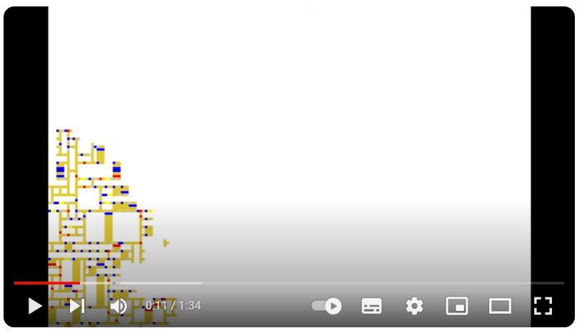
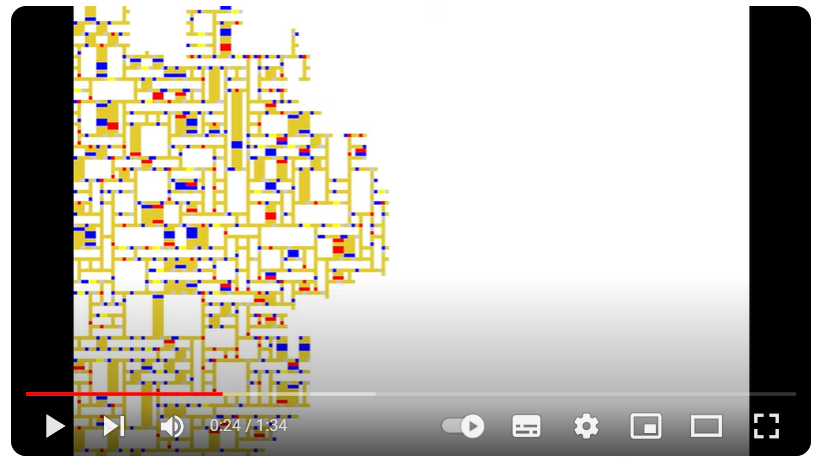
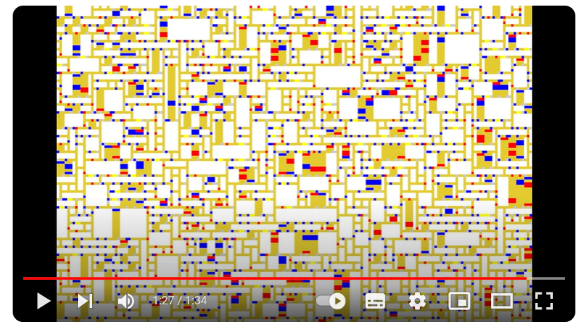
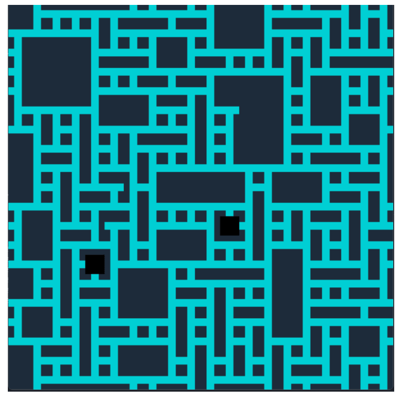

# Week-8
## Imaging Technique Inspiration
Our group chose Piet Mondrian 'Broadway Boogie Woogie' and I plan to use similar abstract geometric forms and contrasting colors in my projects. I found a piece of   ["Mondrian" variation I: Wave Function Collapse](https://www.youtube.com/watch?v=uolWP75hj_k) on youtube. 
This piece has random Mondrian-esque lines. The use of the Wave Function Collapse algorithm (WFC) demonstrated in this piece aligns well with our future project needs because it effectively reproduces Mondrian’s strict geometric aesthetics and color contrasts. The adoption of this technique will help us explore more auto-generated and highly customized visual effects in our future design projects, thereby enhancing user engagement and visual appeal.

## Coding Technique Exploration
To efficiently implement large-scale geometric abstract images similar to those of Mondrian in my project, and to improve the random placement of image elements, I have chosen to use the Wave Function Collapse algorithm (WFC). This algorithm allows for the procedural generation of images starting from a simple set of initial parameters and a rule set, without the need for artificial intelligence technologies. By defining specific pattern rules and color constraints, the WFC algorithm can automatically and randomly arrange each part of the image while adhering to established rules, effectively reproducing Mondrian’s strict geometric composition and vivid color contrasts.

**Technology Display:**

- Screenshot of a Mondrian-style image generated using the WFC algorithm.
- Link to a project example that uses the WFC algorithm to achieve a Mondrian style, including sample code.
  
[Click here to view the link to the technical implementation of this code](https://dev.to/kavinbharathi/the-fascinating-wave-function-collapse-algorithm-4nc3)

Unfortunately, this technique uses Python. It is very difficult for us to implement it using p5.js.